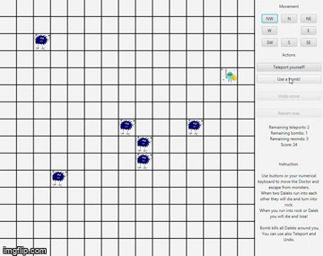
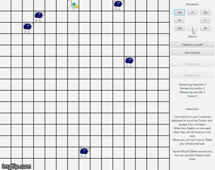

# Daleks game

A project for Object-Oriented Technologies course at AGH University.

Developed by:
- Krzysztof Widenka, [@krzwid](https://github.com/krzwid)
- Patryk Skupień, [@skupien](https://github.com/skupien)
- Natalia Brzozowska, [@brzozia](https://github.com/brzozia)

### Game description
<i>Daleks game</i> is a game with two types of characters:
- doctor - the main character controlled by a player
- daleks - monsters who want to eat doctor

To get rid of the daleks from the board and win the game, you have to move the doctor in such a way as to collide the daleks with each other or with the dead daleks. Dead daleks (fossils) are formed precisely when dalkes collide with each other. They are like very sharp stones on the board.  
You have two power-ups. The first one is a teleport (3 per each board) and second one is a bomb (two per each board).

### Control
To move the doctor you can use your mouse or keyboard. The keyboard buttons move Doctor in the right directions:

7  &nbsp;8  &nbsp;9  
4  &nbsp;&nbsp;&nbsp;&nbsp; 6  
1  &nbsp;2  &nbsp;3  
- Teleport - "T" or "5" 
- Bombs - "B".
- Restart of the game or next level - "R"

### Sample gameplay

  

Pictures from [Pixabay]("https://pixabay.com/pl/?utm_source=link-attribution&amp;utm_medium=referral&amp;utm_campaign=image&amp;utm_content=1295483") by [OpenClipart-Vectors]("https://pixabay.com/pl/users/openclipart-vectors-30363/?utm_source=link-attribution&amp;utm_medium=referral&amp;utm_campaign=image&amp;utm_content=1295483") and [Abhilash Jacob]("https://pixabay.com/pl/users/abhi_jacob-8581153/?utm_source=link-attribution&amp;utm_medium=referral&amp;utm_campaign=image&amp;utm_content=5077346")
